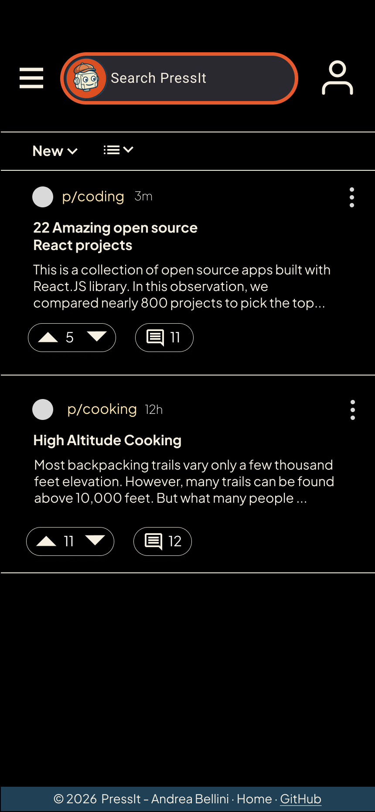
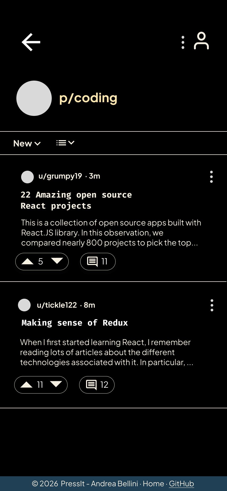

  

A Reddit-inspired news aggregator — React frontend for the Headless Press API

  <a href="https://www.figma.com/proto/ckT1daSU4xjWEM9DCPLZRM/Headless-Press-API-front-end?node-id=0-1&t=GSGX4uLt2lVfTIgt-1">📱 Prototype</a> ·
  <a href="./planning/planning.md">💡 Planning Docs</a> ·
  <a href="https://PLACEHOLDER.netlify.app">🚀 Live Demo</a> ·
  <a href="https://github.com/vertigo1919/headless-press-api"> 🌐 Backend Repo</a>

---

## Overview

PressIt is a news aggregator built with React. The goal was to recreate core Reddit functionality while keeping the UI minimal while practicing React. Users can browse articles across topics, vote on content, read and post comments, and explore articles by author.It connects to my [Headless Press API](https://github.com/vertigo1919/headless-press-api) (Node + Express), which handles articles, topics, comments and voting.

## Screens

## Screens

| Home                                                           | Article                                                           | Topic                                                           | User                                                           |
| -------------------------------------------------------------- | ----------------------------------------------------------------- | --------------------------------------------------------------- | -------------------------------------------------------------- |
|  |  |  |  |

## Routes

| Path                   | View                                    |
| ---------------------- | --------------------------------------- |
| `/`                    | Home feed — all articles, sortable      |
| `/p/:topic`            | Topic page — articles filtered by topic |
| `/p/:article_id/:slug` | Single article + comments               |
| `/u/:username`         | User profile (articles by author)       |

## Installation

Add later
