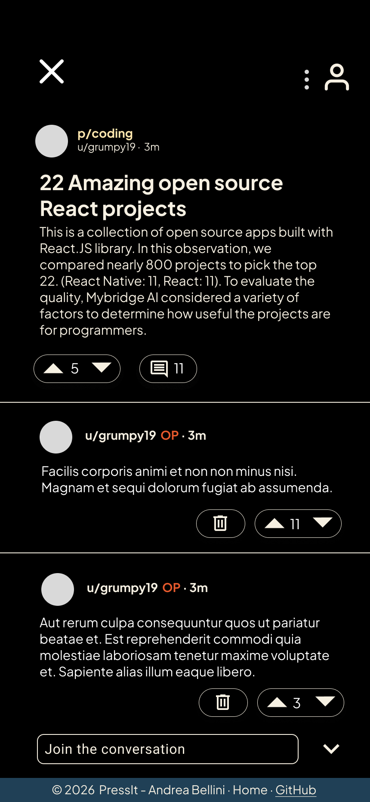
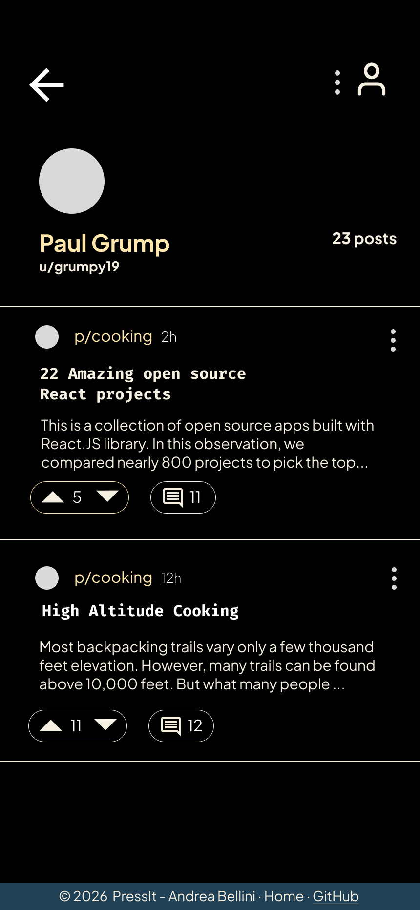

# PressIt — Design Documentation

## Logo

|                Full Logo                 |                  Minimal (avatar)                   |
| :--------------------------------------: | :-------------------------------------------------: |
|  |  |

A retro-styled robot operating a printing press, surrounded by upvote/downvote arrows. The minimal version (robot head only) is used as the in-app avatar inside the search bar and as the favicon.

---

## Colour Palette

| Name         | Hex       | Usage                                 |
| ------------ | --------- | ------------------------------------- |
| Press Orange | `#E75A2D` | Primary accent, CTAs, links, OP badge |
| Press Navy   | `#204056` | Logo border, dark UI elements         |
| Press Cream  | `#FFE7AE` | Warm highlights, hover states         |
| Black        | `#000000` | App background (dark mode)            |
| Off-white    | `#F6F0E2` | Body text on dark background          |
| White        | `#FFFFFF` | Pure white text, icons                |

---

## Typography

**Plus Jakarta Sans** — single font family across all UI.

```css
@import url('https://fonts.googleapis.com/css2?family=Plus+Jakarta+Sans:ital,wght@0,200..800;1,200..800&display=swap');

body {
  font-weight: 400;
}
h1,
h2 {
  font-weight: 700;
}
.article-title {
  font-weight: 600;
}
.meta,
.label {
  font-weight: 300;
}
```

---

## Routes

| Route                  | View                      | API                                                        |
| ---------------------- | ------------------------- | ---------------------------------------------------------- |
| `/`                    | Home feed                 | `GET /api/articles`                                        |
| `/p/:topic`            | Topic article list        | `GET /api/articles?topic=:topic`                           |
| `/p/:article_id/:slug` | Single article + comments | `GET /api/articles/:id` + `GET /api/articles/:id/comments` |
| `/u/:username`         | User's articles           | `GET /api/articles?author=:username`                       |

---

## Screens & Features

### 1. Home Feed `/`


- **Search bar** with PressIt logo avatar
- **Hamburger menu** — opens left drawer listing all topics
- **Sort controls** — New, Most Commented, Least Commented, Most Votes, Least Votes
- **View toggle** — extended (title + excerpt) or compact (title only); reflected in URL
- **Article cards** — topic tag, time since posted, title, excerpt, vote count, comment count
- **Topic icons** alongside topic tag, link to `/p/:topic`
- **Comment count button** — navigates to article comment section
- **Dot menu** — share article
- **User icon** (top right) — links to logged-in user profile
- **Footer** — Home (`/`) and GitHub

---

### 2. Single Article `/p/:article_id/:slug`



- **Article header** — topic icon, topic link, author, time since posted
- **Full article body**
- **Vote buttons** — upvote/downvote, one vote per session
- **Comments** — username, OP badge (orange, if commenter is article author), time, vote buttons
- **Delete button** (🗑) — visible only on comments by the logged-in user
- **"Join the conversation" bar** — sticky bottom; expands to text input with Cancel and Post
- **Dot menu** — share article
- **User icon** (top right) — links to logged-in user profile
- **Footer** — Home and GitHub

---

### 3. Topic Page `/p/:topic`


- **Topic header** — topic avatar and topic name
- **Sort controls** — same options as home feed
- **View toggle** — extended / compact
- **Article cards** — username, time, title, excerpt, votes, comments
- **Dot menu** per card — share article
- **User icon** (top right) — links to logged-in user profile
- **Footer** — Home and GitHub

---

### 4. User Page `/u/:username`



- **User header** — avatar, display name, `u/username`, post count
- **Article list** — all articles by this user in card format
- **Article cards** — topic tag, time, title, excerpt, votes, comments
- **Back button** — returns to previous page
- **Dot menu** per card — share article
- **User icon** (top right) — links to logged-in user profile
- **Footer** — Home and GitHub

---

## Component Tree

```
App
├── UserContext (hardcoded logged-in user)
├── Navbar
│   ├── HamburgerMenu → TopicList
│   ├── SearchBar (with logo avatar)
│   └── UserAvatar → /u/:username
├── Routes
│   ├── / → HomePage
│   │   ├── SortControls
│   │   ├── ViewToggle
│   │   └── ArticleList → ArticleCard[]
│   ├── /p/:topic → TopicPage
│   │   ├── TopicHeader
│   │   ├── SortControls
│   │   ├── ViewToggle
│   │   └── ArticleList → ArticleCard[]
│   ├── /p/:article_id/:slug → ArticlePage
│   │   ├── ArticleHeader
│   │   ├── ArticleBody
│   │   ├── VoteButtons
│   │   ├── CommentList → Comment[]
│   │   │   ├── VoteButtons
│   │   │   └── DeleteButton (if author === currentUser)
│   │   └── CommentComposer (sticky)
│   └── /u/:username → UserPage
│       ├── UserHeader
│       └── ArticleList → ArticleCard[]
└── Footer
```
